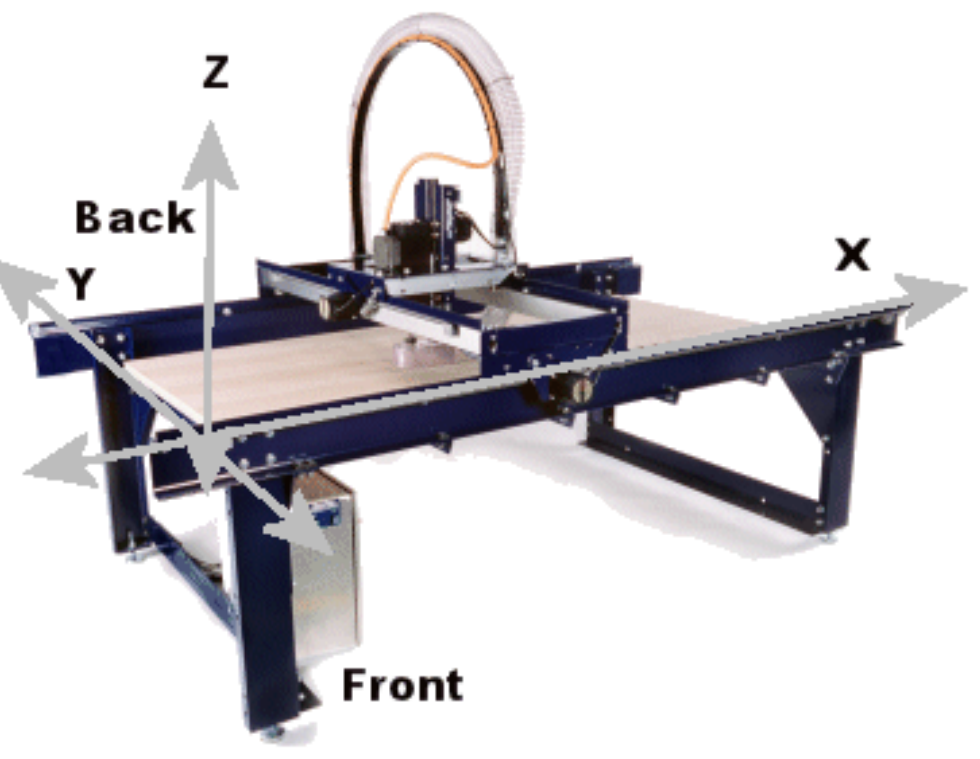

# Fusion 360 ShopBot CNC Toolpath Best Practices

## ⚠️ Pre-Cut Checklist

- [ ] Set manufacturing units to **inches** (ShopBot compatibility) - Manufacture > Units
- [ ] Set manufacturing origin to **top of workpiece, bottom left** - Setup > WCS
- [ ] Put the **long dimension of the sheet on X** - Setup > WCS > Orientation ([why](#table-layout--axes))
- [ ] Leave room for the **cutter radius outside the part** - a profile cut needs travel beyond the stock edge
- [ ] Verify material thickness and wasteboard clearance - Setup > Stock
- [ ] Check tool library and speeds/feeds (RPM is fixed on ShopBot) - Operation > Tool
- [ ] Review toolpath simulation for collisions and rapid moves
- [ ] Keep tool numbers **1-19** for z-axis operations
- [ ] Use **conventional cuts** (climb cutting) - Operation > Passes > Sideways Compensation == Left
- [ ] Use multiple step-downs and roughing passes for accuracy - Operation > Passes > Multiple Depths
- [ ] **Check XY jog speed is faster than move speed** before using the jog utility - type `JS` on the ShopBot ([why](#jog-speed-has-to-beat-move-speed))
- [ ] Run jogging utility: <https://github.com/peterb154/shopbot_jog> to speed up cuts

---

## Quick Reference

### Table Layout & Axes



*ShopBot User Guide p16, © 2015 ShopBot Tools, Inc.*

- **X is the long axis**, left to right across the table (the *short* axis on a Buddy)
- **Y is the short axis**, across the gantry
- Low values at the **bottom left**; X increases to the right, Y increases toward the back

On a 96" x 48" PRSalpha this means an 8ft sheet runs along **X**. Laying it out on Y
silently costs you half the travel and won't be caught until the machine faults.

A profile cut also needs the cutter to travel one **tool radius past the part edge**, so a
job sized exactly to the table cannot be cut - budget clearance for the bit plus room to
clamp and square the sheet.

Machine definition for the MCC tool: `ShopBot PRSalpha 96x48.mch` (import via
Manufacture > Manage > Machine Library). Tool library: `MCC ShopBot.tools.json`.

### Essential Setup

**Units & Post Processing:**

- Manufacturing units: **Inches** (ShopBot native format)
- Post processor: **ShopBot OpenSBP** (included with Fusion)
- Always verify units when post-processing

**Cutting Direction:**

- Use **conventional cuts** (climb cutting) for better surface finish and tool life

### Tool Management

**Tool Library:**

- But tools that have a fusion library or are already in the fusion library. This makes speeds and feeds much easier
- Fusion includes Amana router bits (searchable by model number)
- Download SPETool database: <https://spetools.com/pages/spetool-tool-file-database>
- Copy frequently used bits to a local library that you create for each machine you use for quick access.
If the machine RPM is fixed (like MCC shopbot) set the RPMs in the local library to the shopbot speed.
This will change the feed speeds accordingly to get the correct chip load

**Tool Numbering:**

- Keep tool numbers 1-19 for Z-axis operation
- Higher Tool numbers 20+?  will trigger A-axis operations.

  > ShopBot tool numbering conventions vary depending on whether your machine has an Automatic Tool Changer (ATC), but generally involve a system where tool numbers 1-19 are reserved for the Z-axis in systems without an ATC
- Can number tools in a fusion library dedicated for a specific machine (i.e MCC Shopbot). It's nice to have copies of just the tools I frequently use with a specific machin in my library with unique and low numbers. That way when shopbot command center confirms "So you have tool #3 inserted" before a cut, I can verify which one it is expecting by looking at fusion.

**Compression Bits:**

- Max stepdown must equal or exceed upcut portion depth or you'll get tearout
- Example: 1/4" SPETool compression bit requires 6.4mm max stepdown

---

## Speeds & Feeds Reference

---

## Operation-Specific Guidelines

### 2D Operations

#### Contour/Profile

- **Through cuts:** Set bottom height to Stock Bottom -0.02" (or -0.04" if using cheap, inconsistent plywood)
- **1/4" compression bit clean cuts:**
  - Enable at least 2 roughing passes
  - Max stepover: 0.1"
  - Number of stepovers: 2
  - Multiple depths max roughing: 0.5"

### vCarve 1/4" Endmill Settings for Shopbot - 2D Operations

> ⚠️ Written early on and probably too conservative - prefer the SpeTool OEM
> presets. 80 in/min at 14,000 RPM on a 2-flute is 0.0029 in/tooth, low enough to
> rub rather than cut; Onsrud's range for 1/4" in plywood is 0.005-0.020. The
> 2026-09-01 job ran 180 in/min (0.0064) cleanly. Superseding this table is on the
> list.

| Parameter | Value | Notes |
|-----------|-------|-------|
| **Spindle RPM** | 14,000 | this is fixed on mcc shopbot? |
| **Feed Rate** | 80 in/min | slower than SpeTool suggested 145in/min for hardwood |
| **Plunge Rate** | 40 in/min | slower than SpeTool suggested 76in/min for hardwood |
| **Max Stepdown** | 4.25mm (0.167") | this is based on 4 stepdowns on 18mm ply. SpeTool suggests 0.25" |
| **Total Passes** | 4 (full depth) | |
| **Stepover** | 40% (0.1" for 1/4" bit) | this is critical for clean, & precice cuts. SpeTool suggests 0.1" also |
| **Cut Direction** | Conventional | |
| **Ramps** | Smooth, 25.4mm (1") | Havent tested with/without these. SpeTool suggest 2 degree ramp angle |

#### Drilling

- **Through holes:** Set bottom height -0.1" below material
- **M4 furniture inserts:** Use 7/32" hole size

### 3D Operations

#### 3D Contour

- **Beveled edges:** Max stepdown 0.04" with "Amana Tool 46286 Tapered Ball Nose (3.6° tip, 0.125", 0.25")" works well

---

## In-Process Learnings

> Notes from real jobs, not settled doctrine. Each is one data point on one part
> on the MCC ShopBot - worth trying, worth re-measuring, likely to be superseded.

### 2026-09-01 - Wheel Mount, 5 parts nested on an 18mm x 467mm x 2438mm strip

Cycle time went 38 min -> 17.5 min. What actually moved the needle, in order:

| Change | Saved | Confidence |
|---|---|---|
| Max stepdown 0.25" -> 0.365" (3 passes -> 2) | ~14 min | high, re-measured |
| Open chains -> closed chains | ~6 min | high, but see caveat |
| M3 -> J3 jog conversion | ~1 min | small on this job |
| Ramp angle 2° -> 10° | ~0 | no effect, see below |
| Stepdown 9.0mm -> 9.27mm (3 passes -> 2) | ~0 | ramp cost offset it |

#### Jog speed has to beat move speed

The machine was set to **XY jog 1 in/sec against a 3 in/sec move speed**, so
converting M3 to J3 made the file ~6.6 min *slower*. `shopbot_jog` assumes jog is
faster and does not check. Set it with `JS` (session) or `VS` (default); the
manual rates a spindle alpha at ~30 in/sec jog. Ran 6 in/sec, which was fine.

Anyone can change this on a shared machine - check it every time.

#### A finishing pass needs stock left for it - biggest thing to fix next

Ran this job with **no finishing pass in practice**, and it showed:

```text
doRoughingPasses          = False
useStockToLeave           = False   stockToLeave = 0.0
doMultipleFinishingPasses = True    2 stepovers @ 0.025"   <- cutting air
```

Finishing stepovers with zero stock to leave have nothing to remove - the first
pass already cuts to final size. Every cut was a single full-width slot.

Two symptoms, both traceable to that:

- **Rough edges** - no light pass ever cleans the slot wall
- **Tight finger joints** - a 1/4" bit taking a 9.27mm full-width slot at 180 ipm
  deflects. `compensationType = computer` offsets by exactly the tool radius and
  assumes a rigid cutter, so slots come out narrow and fingers proud. Deflection
  is worst at full engagement.

Fix (this is what the checklist already says, we just never applied it):

```text
doRoughingPasses = True    2 passes, max stepover 0.1"
useStockToLeave  = True    ~0.02" radial
```

Then the last pass is a real light cut where deflection is negligible. Knock-on
effects: cut direction finally matters (so `compensation = left` starts doing
something, and the open-pass zig-zag warning becomes worth suppressing), and it
costs maybe 2-3 min on a job this size.

Separately - check the **modelled joint clearance**. Fingers drawn nominal are an
interference fit in plywood no matter how good the cut is. Measure a cut joint
with calipers before blaming CAM; 0.1-0.2mm per mating face is a normal starting
point.

#### Closed chains were faster than open chains

Counter-intuitive. Open chains avoid cutting the sheet edges, but Fusion links
open passes with a both-ways zig-zag that smears the descent across the whole
chain. Cutting air on a closed loop was cheaper:

```text
open    flat 8.56  Z-changing 12.11  air 3.11  = 23.8 min
closed  flat 9.60  Z-changing  6.56  air 1.68  = 17.9 min
```

Caveat: closed chains put the bit ~5mm past the sheet, so the spoilboard takes a
cut and Y zero needs to sit inboard. Worth re-testing on a part with a different
mix of open/closed geometry.

#### Ramp angle does nothing on open chains

Changing 2° -> 10° moved 4.5 inches out of 2180. The ramp angle only governs
closed-contour entry; open passes use the zig-zag link instead. Don't bother
tuning it unless the contours are closed.

#### Watch how the stepdown divides

Fusion rounds pass count up, so a stepdown fractionally under `depth / N` costs a
whole extra pass. 18.508mm at 9.0mm gave 3 passes (9.0 + 4.75 + 4.75); 9.5mm gave
2 even passes. Check the division rather than picking a round number.

#### Compression bits and the first pass

Only the first pass cuts the top surface, so its depth has to clear the up-cut
portion or the up-cut flutes tear the face veneer. Deeper first pass is better
for finish as well as time. Measure the flute reversal point on the actual bit -
the 6.4mm figure below came from a different bit than the W02011.

#### Don't put a twist drill in at router RPM

A 1/4" bit at 14,000 RPM is 916 SFM. Fine for carbide router bits (SpeTool's own
presets for the W04013 say 916 SFM); 3-9x too fast for an HSS twist drill, which
will just burn. Since spindle RPM is fixed, holes need a router bit - and a
flat-bottom one also makes the -0.02" breakthrough correct, where a 120° point
needs -0.09" before the full diameter clears.

#### Still unexplored

- **Roughing + stock to leave** - top of the list, see above. Costs a few minutes,
  should fix both edge finish and joint fit
- Tab spacing - 2" gave ~50 tabs on the largest part. A bit aggressive, but at
  1/4" x 1/16" they were thin enough to cut free quickly with a vibratory saw, so
  removal was not the problem the count suggested. Try opening the spacing up and
  see how few still hold
- Single pass at full 18.5mm depth (2.9x dia) - would be the next big cut in time
- Whether the jog conversion is worth it at all once jog speed is set properly
- Feed above 180 ipm; Onsrud's plywood chipload range runs to 0.020 vs our 0.0064

### 2026-09-02 - F16 frame, 92 parts across 6 sheets, built via the Fusion API

Setups and operations for 5 of the 6 sheets were generated by script rather than
by hand (`scripts/`). The point was not speed - it was that every sheet gets the
same derived numbers instead of 21 chances to mistype one.

#### Check the nest against machine travel before building any CAM

The binding constraint is not the sheet, it is the travel minus two cutter radii:

```text
valid stock offset = [R, travel - part_span - R]
```

On a 2438.4mm X travel with a 1/4" bit, a nest spanning 2431.5mm leaves **0.57mm**
of latitude - not cuttable, since you cannot square a sheet to half a millimetre.
Same job, another sheet spanned 2419.2mm and had 12.9mm, which is fine. The
difference was one part sitting at the far edge.

Worth catching before toolpaths exist, because the fix is to move a part, and
every operation downstream of that part has to be regenerated. `offsets.py`
reports the range per sheet; `shift.py` names the offending part and how far it
has to move.

#### Boring a hole that is exactly the tool diameter is the wrong operation

520 of 549 small holes were 6.35mm - exactly 1/4". Helical-boring them with the
1/8" bit was **95.2 min per sheet**. The same 260 holes as a drill operation with
the 1/4" bit and a 4mm chip-breaking peck: **4.0 min**. Verified by posting and
counting - 260 distinct XY positions reaching -0.4924" (12.51mm, breakthrough
applied), not by trusting the estimate alone.

Roughly halves the whole job, 5.9h -> ~2.9h. Open question is whether the W02011
compression bit will plunge cleanly; the 1/4" endmill left burn marks on 4 holes
on 2026-09-01, which is what prompted buying the 1/8" in the first place. Pecking
addresses chip packing, which is the likely cause, but if the bit is not
centre-cutting it will rub no matter what the peck depth is. **Test on scrap.**

#### Fusion API traps that cost real time

- **Bounding boxes on rotated occurrences are the transformed AABB** and are
  inflated - a 12mm part reported faces spanning Z -14.5..50.5. Measure from
  `body.vertices`. This caused two separate wrong answers before it was spotted.
- **Classify features by edge type, not geometry extent.** A face whose loops
  contain any `Line3D` is a pocket corner fillet; circles with no arcs are holes.
  Selecting by bounding box picked up 36 fillets as holes, then dropped real
  holes when "corrected".
- **`tool_feedCutting` lives on the operation, not on `op.tool`.** Setting it on
  the tool silently does nothing and the operation keeps its old feed through
  regeneration.
- **`getCurveSelections()` returns a copy** - it does nothing until
  `applyCurveSelections()`.
- **A leftover operation with no toolpath breaks posting**, and the error is
  `3 : Initialization fails` with no indication which operation is at fault. Run
  `cleanup.py` before posting.
- **An MCP call timing out does not mean the build failed.** Fusion keeps going;
  a 30-part sheet outran the HTTP timeout and completed fine. Check `status.py`
  before rebuilding, or you will clear work that succeeded.

#### Outer profiles: silhouette, not the bottom face

The bottom face is the wrong outline on a bevelled part - on some of these it was
28-34% of the actual footprint. `createNewSilhouetteSelection` with
`OnlyOutsideLoops` traces the true outline. `AllLoops` warns that lead parameters
would collide, because it tries to take the inner features with the same lead-in.

---
---

## Known Issues & Investigation

**Current Problems:**

- Drill hole tearout at top surface (especially cheap sheathing) - solution needed
  - Untested idea: down-cut spiral (SpeTool W04013) instead of a drill; down-shear
    should press the top fibres rather than lift them
